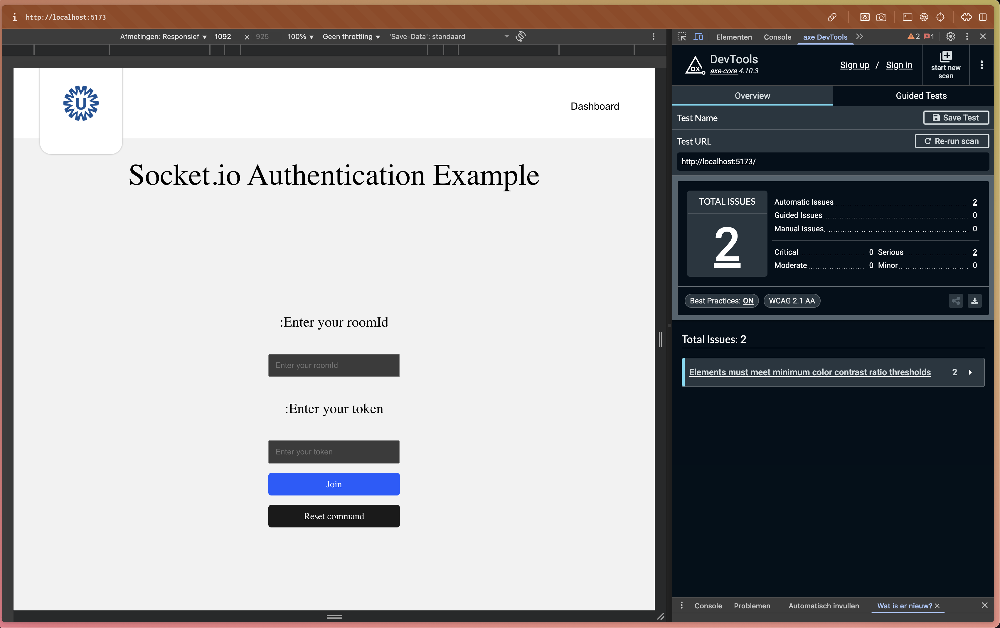
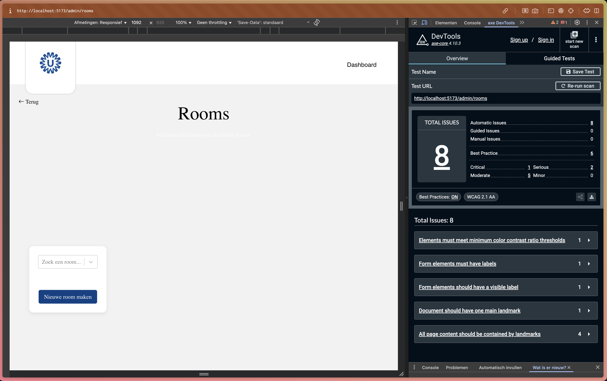
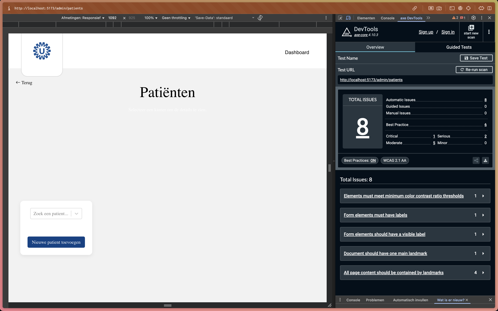
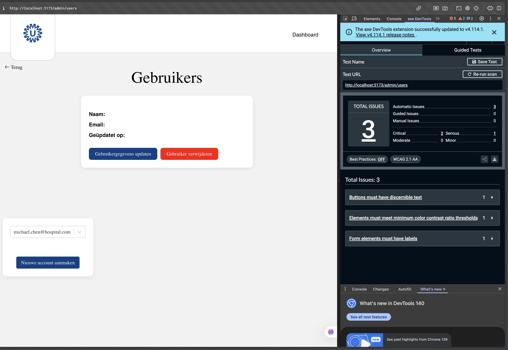

## Research on User Interface (UI) Improvements for the Web Application

### Research Question

As a UX researcher, I want to investigate how the current user interface of the web application can be improved, so that users experience a more intuitive, consistent, and visually appealing design.

### Hypothesis

- The current UI contains inconsistencies that make navigation and interaction less intuitive.
- Improving the layout, color scheme, and typography will make the app more visually appealing and easier to use.
- Aligning UI elements with established design patterns will reduce user errors and increase task efficiency.

### Background & Context

The web application has grown over time, but its UI has not been systematically evaluated against modern design standards. Some UI elements appear outdated or inconsistent, which may cause confusion or friction for users. No recent research has been conducted to confirm whether the interface aligns with best practices in usability and accessibility. This study focuses on identifying UI-specific improvement opportunities, independent of backend or performance issues.

### Methodology

- Heuristic Evaluation: Assess UI against usability principles and WCAG 2.1 AA accessibility guidelines.
- UI Audit: Review consistency in colors, typography, buttons, spacing, iconography, and interaction states (hover/focus/active/disabled).
- Synthesis & Recommendations: Summarize findings into actionable UI changes, with example mockups and style-guide proposals.

### Expected Deliverables

- UI audit report (consistency, strengths, weaknesses).
- Annotated screenshots highlighting issues and potential improvements.
- Recommendations aligned with design best practices and accessibility standards.

### Annotated screenshots

- **Homepage**: landmarks, color contrast, visible labels.

  
- **Rooms**: main landmark, form labels, contrast in filters/CTA.

  
- **Patients**: search/select labels, contrast, content within landmarks.

  
- **Users/Admin**: heading level, contrast on accent buttons, focus styles.

  

## Findings

### Executive summary

- Navigation and control discoverability suffer due to icon-only buttons and weak hierarchy.
- Missing semantics (main/landmarks) and low contrast breach WCAG; labels often absent.
- Limited state feedback (loading/results) causes uncertainty; lock/connection states are unclear.
- Cross-platform inconsistencies between Web and HoloLens confuse users.

Quick wins (≤1 day)

- Add tooltips/labels to icon-only controls; increase hit-targets/spacing.
- Introduce toasts for async outcomes; differentiate lock/unlock visuals.

Near-term (≤1 week)

- Add top app bar with status chip/progress; regroup controls (Transform/View, Session/File).
- Add skeleton loaders and confirmation modals for destructive actions.

Measurement focus

- Task success time, error rate, perceived responsiveness, unintended taps.

### Scope

- **Platforms**: Web frontend (React/Vite), HoloLens (Unity/MRTK)
- **Personas**: Clinician (primary), Technician/Admin (secondary), Patient (indirect)

### Key observations

- **Navigation discoverability**: Users overlooked secondary actions (reset, lock, orientation) due to low visual hierarchy and icon-only controls.
- **Control density**: The action cluster around the 3D canvas feels crowded on smaller viewports; accidental taps occur.
- **Feedback gaps**: Model operations (load, download, align) provide limited system feedback; users unsure if an action succeeded.
- **State ambiguity**: Lock/unlock and room/connection states look similar across states; unclear affordances.
- **Terminology & labels**: Some domain terms (room, connection, patient link) are unclear without microcopy.
- **Performance perception**: Large model load feels slow; lack of progressive states increases perceived latency.
- **Cross-device consistency**: Control metaphors differ between Web and HoloLens; mental model doesn’t transfer seamlessly.

<details>
<summary><strong>Homepage audit (first pass)</strong></summary>
- **Typography**: Huidige font-family oogt verouderd. Advies: vervang door een moderne, systeemvriendelijke stack zoals `Inter, -apple-system, BlinkMacSystemFont, "Segoe UI", Roboto, Helvetica, Arial, sans-serif` of `Source Sans 3` met `font-display: swap`.
- **Kleurenschema**: Onvoldoende contrast in primaire en grijstinten. Definieer design tokens (primary/neutral/success/warning/danger) met AA-contrast (minimaal 4.5:1 voor body-tekst, 3:1 voor grote tekst/icoonknoppen) en dark-mode varianten.
- **WCAG bevindingen (axe, homepagina, 8 issues)**:
  - 3x "Elements must meet minimum color contrast ratio thresholds" → primaire knop, invoervelden, linkkleur.
  - 1x "Document should have one main landmark" → ontbrekende `<main>`.
  - 4x "All page content should be contained by landmarks" → zorg voor `<header>`, `<main>`, `<footer>` en aria-labels op navigatie.
- **Aanvullend**: Form labels en hint-tekst verbergen placeholder-afhankelijkheid; voeg zichtbare labels toe boven inputs.

#### Aanbevelingen (homepage, concreet)

1) **Typography**
   - Stel basis op 16 px, schaal H1–H6 met type scale (bijv. 1.25). Kies `Inter` of `Source Sans 3` en activeer `font-feature-settings: "ss01", "tnum"` waar relevant.
2) **Kleur & contrast**
   - Primaire kleur: kies een blauw rond `#1463FF` (of bestaande merktoon) met focus-staat `outline: 2px solid #1A73E8` en tekst op knop `#FFFFFF` (contrast ≥ 4.5:1).
   - Neutrals: vervang lichtgrijs voor velden naar `#E5E7EB` borders en `#111827` tekst; placeholder `#6B7280`.
3) **Landmarks & structuur**
   - Voeg semantiek toe: `<header>`, één `<main role="main">` rond de centrale content, `<footer>`.
   - Zorg dat alle content binnen landmarks valt; nav heeft `aria-label="Dashboard"` indien meerdere navigaties aanwezig zijn.
4) **Formulieren**
   - Zichtbare `<label>` gekoppeld via `for/id`; hulptekst onder het veld i.p.v. placeholder als enige uitleg.
5) **Toegankelijkheid**
   - Focusvolgorde toetsenbord checken; duidelijke focus styles op alle interactieve elementen.
   - Voeg `aria-live="polite"` toe voor statusmeldingen (join/reset feedback).

</details>
- **Typography**: Huidige font-family oogt verouderd. Advies: vervang door een moderne, systeemvriendelijke stack zoals `Inter, -apple-system, BlinkMacSystemFont, "Segoe UI", Roboto, Helvetica, Arial, sans-serif` of `Source Sans 3` met `font-display: swap`.
- **Kleurenschema**: Onvoldoende contrast in primaire en grijstinten. Definieer design tokens (primary/neutral/success/warning/danger) met AA-contrast (minimaal 4.5:1 voor body-tekst, 3:1 voor grote tekst/icoonknoppen) en dark-mode varianten.
- **WCAG bevindingen (axe, homepagina, 8 issues)**:
  - 3x "Elements must meet minimum color contrast ratio thresholds" → primaire knop, invoervelden, linkkleur.
  - 1x "Document should have one main landmark" → ontbrekende `<main>`.
  - 4x "All page content should be contained by landmarks" → zorg voor `<header>`, `<main>`, `<footer>` en aria-labels op navigatie.
- **Aanvullend**: Form labels en hint-tekst verbergen placeholder-afhankelijkheid; voeg zichtbare labels toe boven inputs.

### Aanbevelingen (homepage, concreet)

1) **Typography**
   - Stel basis op 16 px, schaal H1–H6 met type scale (bijv. 1.25). Kies `Inter` of `Source Sans 3` en activeer `font-feature-settings: "ss01", "tnum"` waar relevant.
2) **Kleur & contrast**
   - Primaire kleur: kies een blauw rond `#1463FF` (of bestaande merktoon) met focus-staat `outline: 2px solid #1A73E8` en tekst op knop `#FFFFFF` (contrast ≥ 4.5:1).
   - Neutrals: vervang lichtgrijs voor velden naar `#E5E7EB` borders en `#111827` tekst; placeholder `#6B7280`.
3) **Landmarks & structuur**
   - Voeg semantiek toe: `<header>`, één `<main role="main">` rond de centrale content, `<footer>`.
   - Zorg dat alle content binnen landmarks valt; nav heeft `aria-label="Dashboard"` indien meerdere navigaties aanwezig zijn.
4) **Formulieren**
   - Zichtbare `<label>` gekoppeld via `for/id`; hulptekst onder het veld i.p.v. placeholder als enige uitleg.
5) **Toegankelijkheid**
   - Focusvolgorde toetsenbord checken; duidelijke focus styles op alle interactieve elementen.
   - Voeg `aria-live="polite"` toe voor statusmeldingen (join/reset feedback).

<details>
<summary><strong>Admin dashboard audit (eerste scan)</strong></summary>
- **axe resultaat (5 issues)**
  - 2x "Elements must meet minimum color contrast ratio thresholds" → accentknop en mogelijk linkkleuren.
  - 1x "Document should have one main landmark" → ontbrekende `<main>`.
  - 1x "Page should contain a level-one heading" → voeg één `<h1>` toe (bijv. "Admin dashboard").
  - 1x "All page content should be contained by landmarks" → omkader content met `<header>`, `<main>`, `<footer>`.
- **Bronnen in code**
  - Kleuren: `apps/frontend/src/index.css` (CSS custom properties) en button classes in `apps/frontend/src/ui/styles/pages/admin/Dashboard.css`.
  - Accentknop gebruikt `--accent-color: #fc6039` met witte tekst → contrast onvoldoende.

### Aanbevelingen (admin dashboard, concreet)

1) **Landmarks & heading**
   - Voeg een unieke `<h1>Admin dashboard</h1>` toe en plaats hoofdcontent in `<main role="main">`.
2) **Contrastfix knoppen**
   - Houd primaire knop donkerblauw met witte tekst (voldoende contrast).
   - Pas accent-knop aan: kies óf een donkerdere accentkleur met witte tekst, óf behoud `#fc6039` maar gebruik donkere tekst.
     - Optie A (donkere accent): `--accent-color: #C03412`, `--text-on-accent: #FFFFFF` (AA ≥ 4.5:1).
     - Optie B (lichte accent): `--accent-color: #FF6A3D`, `--text-on-accent: #111827` (AA ≥ 4.5:1).
   - Gebruik token `color: var(--text-on-accent)` voor `.accentBtn` zodat contrast altijd klopt.
3) **Focus styles**
   - Voeg zichtbare focus aan `.accentBtn` en `.primaryBtn` toe: `outline: 2px solid #1449CC; outline-offset: 2px;`.

</details>

<details>
<summary><strong>AA-kleurpalet (voorstel)</strong></summary>
- `--primary-color: #1A5CFF` (hover `#1449CC`), `--text-on-primary: #FFFFFF`
- `--secondary-color: #004285`, `--text-on-secondary: #FFFFFF`
- `--accent-color: #C03412` (alternatief lichte variant: `#FF6A3D`), `--text-on-accent: #FFFFFF` of `#111827` conform keuze
- `--neutral-900: #111827`, `--neutral-700: #374151`, `--neutral-500: #6B7280`, `--neutral-300: #D1D5DB`, `--neutral-100: #F3F4F6`
- `--border-color: #E5E7EB`

</details>

<details>
<summary><strong>Semantische structuur (snippet)</strong></summary>
```html
<header>…</header>
<main role="main" aria-label="Admin dashboard">
  <h1>Admin dashboard</h1>
  <!-- primaire acties en statusmeldingen -->
  <section aria-labelledby="actions">…</section>
  <div aria-live="polite" aria-atomic="true" id="status"></div>
  <!-- alle content binnen <main>  -->
  …
</main>
<footer>…</footer>
```

</details>

<details>
<summary><strong>Implementatie taken (korte checklist)</strong></summary>
- [ ] Voeg `<main>` en één `<h1>` toe op home en admin dashboard.
- [ ] Vervang font-stack door moderne variant en stel basis 16 px in.
- [ ] Implementeer kleur-tokens inclusief `--text-on-*` en pas knoppen aan.
- [ ] Voeg zichtbare focus styles toe en labels voor alle formulieren.
- [ ] Her-run axe; streef naar 0 critical/serious op beide pagina’s.

</details>

<details>
<summary><strong>Rooms pagina audit (eerste scan)</strong></summary>
- **axe resultaat (8 issues)**
  - 1x "Elements must meet minimum color contrast ratio thresholds" → knop- of tekstcontrast in de filter/cta.
  - 1x "Form elements must have labels" → ontbrekende `<label>` gekoppeld via `for/id`.
  - 1x "Form elements should have a visible label" → placeholder is geen label; label visueel tonen.
  - 1x "Document should have one main landmark" → voeg `<main>` toe.
  - 4x "All page content should be contained by landmarks" → structureer met `<header>`, `<main>`, `<footer>`.
- **Aanbevelingen**
  - Voeg boven de zoek/select component een zichtbaar label toe, bijvoorbeeld: `label for="roomSearch"` + `id="roomSearch"` op het invoerveld/select.
  - Voor dropdowns: gebruik `aria-label` alleen als laatste redmiddel; voorkeur is een zichtbare `<label>`.
  - Pas contrast toe op knoppen/tekst binnen de kaart links onder: gebruik tokens uit het AA-palet en `--text-on-*` variabelen.
  - Plaats alle inhoud binnen `<main role="main" aria-label="Rooms">` en houd slechts één `<h1>` (bijv. "Rooms").

</details>

<details>
<summary><strong>Nieuwe room maken pagina audit (eerste scan)</strong></summary>
- **axe resultaat (~16 issues)**
  - "Elements must meet minimum color contrast ratio thresholds" → primaire call-to-action en donkere tekst op gekleurde knoppen/labels controleren.
  - "Form elements must have labels" → ontbrekende labels bij tekstvelden en bestand-upload.
  - "Select element must have an accessible name" → `<select>` mist gekoppelde `<label>` of `aria-label`.
  - "Form elements should have a visible label" → placeholders vervangen/aanvullen met zichtbare labels boven elk veld.
  - "Document should have one main landmark" → ontbrekende `<main>`.
  - "All page content should be contained by landmarks" → structureer met `<header>`, `<main>`, `<footer>`.
- **Aanbevelingen**
  1) Voeg voor elk veld een `<label for="...">` toe, inclusief file input, en koppel met `id`.
  2) Geef elk `<select>` een zichtbaar label; gebruik `aria-describedby` voor hulptekst.
  3) Gebruik het AA-palet: verander CTA-knop naar `--primary-color: #1A5CFF` met `--text-on-primary: #FFFFFF`, of maak accent donkerder met voldoende contrast.
  4) Toon validatiefouten inline (`aria-live="polite"`) en markeer foutvelden met `aria-invalid="true"` + beschrijving.
  5) Plaats alle formulier-content in `<main role="main" aria-label="Nieuwe room">` en behoud één `<h1>`.

</details>

<details>
<summary><strong>Patiënten pagina audit (eerste scan)</strong></summary>
- **axe resultaat (8 issues)**
  - 1x "Elements must meet minimum color contrast ratio thresholds" → CTA/links of tekst in zijpaneel.
  - 1x "Form elements must have labels" → zoek/select veld zonder gekoppelde `<label>`.
  - 1x "Form elements should have a visible label" → placeholder gebruikt als label.
  - 1x "Document should have one main landmark" → ontbrekende `<main>`.
  - 4x "All page content should be contained by landmarks" → content buiten semantische landmarks.
- **Aanbevelingen**
  - Voeg zichtbaar label toe aan zoek/select (bijv. "Zoek een patiënt"), koppel via `for/id`.
  - Breng alle content onder in `<main role="main" aria-label="Patiënten">` en behoud één `<h1>`.
  - Controleer knop/tekst contrast met AA-palet; pas `--text-on-*` variabelen toe.

</details>

<details>
<summary><strong>Nieuw wachtwoord instellen pagina audit (eerste scan)</strong></summary>
- **axe resultaat (~12 issues)**
  - 5x "Elements must meet minimum color contrast ratio thresholds" → waarschuwingstekst (rood op lichtblauw), CTA-knop.
  - 1x "Document should have one main landmark" → ontbrekende `<main>`.
  - 1x "Page should contain a level-one heading" → zorg voor één `<h1>` bovenaan.
  - 5x "All page content should be contained by landmarks" → structureer met `<header>`, `<main>`, `<footer>`.
- **Aanbevelingen**
  1) Labels: beide wachtwoordvelden en e-mail hebben zichtbare labels, gekoppeld via `for/id`.
  2) Validatie/hulptekst: groepeer regels als lijst en koppel met `aria-describedby` aan het wachtwoordveld; gebruik `role="status"` of `aria-live="polite"` voor dynamische feedback.
  3) Contrast: pas waarschuwingstekst naar `#B91C1C` op witte/zeer lichte achtergrond of verhoog achtergrondcontrast; CTA met `--primary-color: #1A5CFF` en `--text-on-primary: #FFFFFF`.
  4) Toetsenbord: duidelijke focus styles op velden en CTA.
  5) Landmarks: plaats formulier binnen `<main role="main" aria-label="Nieuw wachtwoord instellen">`.

</details>

### Heuristic evaluation (Nielsen)

- **Visibility of system status**: Missing progress and success/error toasts for long/async tasks.
- **Match with real world**: Icons lack labels; medical terms need clarifying copy.
- **User control & freedom**: No quick undo for transforms; reset is available but not contextual.
- **Consistency & standards**: Mixed icon styles and spacing; inconsistent hover/focus across components.
- **Error prevention**: Destructive actions (clear, disconnect) lack confirmation.
- **Recognition over recall**: Icon-only toolbar increases recall burden; labels or tooltips needed.
- **Flexibility & efficiency**: Power users lack shortcuts; novices miss hints.

### Prioritized recommendations

1) **Clarify action hierarchy and labels**

   - Add text labels (or persistent tooltips) to critical controls: Reset, Lock, Download, Align.
   - Group related actions into segmented controls: Transform (Rotate/Scale/Translate), View (Front/Left/Right/Top), Session (Connect/Room/Patient).
2) **Introduce progress and result feedback**

   - Global progress bar for model loading; inline skeleton for metadata.
   - Non-blocking toasts for success/error; banner for degraded connection.
3) **Improve state indications**

   - Distinct visual states for Lock vs Unlock (color + icon + label), and for Connected vs Disconnected.
   - Add a compact status chip (e.g., “Room 123 • Connected”).
4) **Reduce accidental taps and visual noise**

   - Increase hit targets to 40–48 px; add spacing and separators.
   - Collapse secondary actions into a kebab menu on small screens.
5) **Add contextual undo and confirmations**

   - Provide one-step undo after transforms and resets.
   - Confirm destructive actions (clear scene, disconnect room) with concise dialogs.
6) **Unify cross-platform metaphors**

   - Mirror control grouping and naming between Web and HoloLens.
   - Reuse icons and color semantics; map gestures to buttons (e.g., “Air tap = Select”).

### Quick wins (≤1 day)

- Add tooltips with clear microcopy to all icon-only buttons.
- Introduce toasts for async outcomes in the web app.
- Differentiate lock/unlock with color and label.
- Increase tap targets and spacing in the toolbar.

### Near-term improvements (≤1 week)

- Implement a top app bar with status chip and global progress.
- Regroup controls into two clusters: Transform + View, Session + File.
- Skeleton loaders for model preview and metadata panel.
- Confirmation modals for destructive actions.

### Design guidelines

- **Typography**: Use one readable scale; minimum 14–16 px body on web, MRTK defaults on HoloLens.
- **Color semantics**: Primary = action, Success = loaded/connected, Warning = degraded, Danger = destructive.
- **Motion**: Subtle 150–200 ms transitions; reduce motion on HoloLens to avoid discomfort.
- **Accessibility**: AA contrast, focus outlines, keyboard navigation; voice command labels on HoloLens.

### Measurement plan

- **Task success**: Time-to-load model; time-to-reset orientation; error rate for wrong action.
- **Perceived performance**: User-rated responsiveness (1–5) before/after progress indicators.
- **Engagement**: Frequency of advanced controls usage after labels/education.
- **Stability**: Drop rate of unintended taps after hit-target increase.

### Implementation notes (code pointers)

- Web: `apps/frontend/src/ui/` for buttons/toolbars; add tooltip and toast primitives.
- Web: Add a global `status` store or context for loading/connection state.
- API: Ensure endpoints return actionable error messages for UI to display.
- HoloLens: Align control naming and icons; surface connection state in HUD.

### Risks and mitigations

- **Visual clutter with labels** → Use responsive labels: full on desktop, icon+tooltip on mobile.
- **Extra steps with confirmations** → Only confirm destructive actions; add one-step undo to reduce friction.
- **Inconsistent semantics** → Centralize tokens (colors, spacing, icon set) and document usage.
